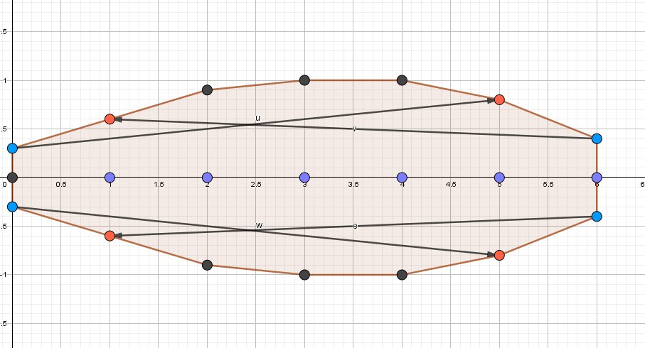
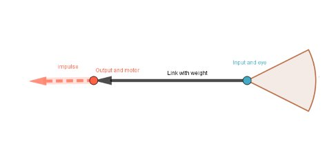
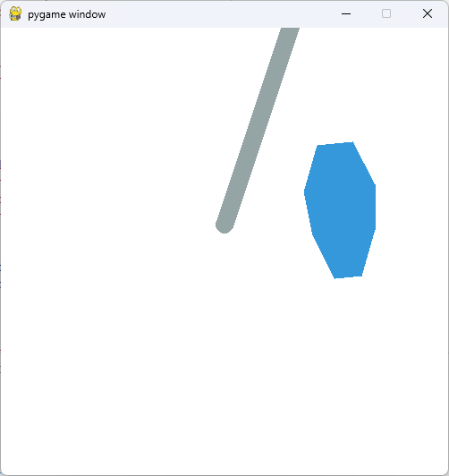
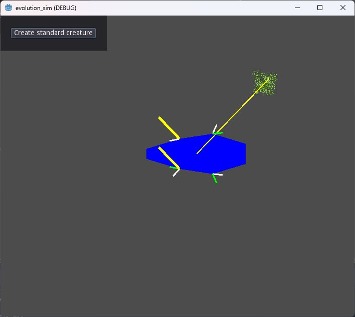

# About
This project (2019/2020) was part of my (ongoing) fascination with artificial life simulations.
In this repository are two abandoned implementations of an (overcomplicated) system of describing alife creatures as 2d bodies.
I was trying to build a software analogue to how genes are transcribed, which ended up complexifying things a bit.

The creatures were described as 2d bodies with a central spine, and the symmetrical shape of the body was determined by how far a body would extend at several points from the spine.
Furthermore, each of the bodies outer points could hold either a sensor indicating the direction of food, or a "thruster", from which an inpulse could be applied to move the creature.
Firing thrusters would spend energy, and creatures would have needed to trade off energy usage, body size, number of thrusters etc.

*Creature body morphology*:  

The challenge I ran into was getting the creatures to actually learn how to move.
Because evolution can randomly shape the creatures and place different thrusters, each creature would need to learn how to successfully navigate towards food.
This is not easy, because thrusters are placed away from the center of mass, causing torque when fired.
I tried to hand-code various movement schemes, but never got it working well.
Again I was inspired by Karl Sims' virtual creatures and the idea that the body morphology could be directly tied to the "brains" topology, i.e. the spacial connections between points sensors and thrusters (seen in the picture above) would correspond to neurons and weights in a simple neural network.
The search for a learning algorithm lead me to [NEAT](https://en.wikipedia.org/wiki/Neuroevolution_of_augmenting_topologies), and my next big project was [implementing this evolutionary algorithm for the godot engine](https://github.com/pastra98/NEAT_for_Godot).

*Body shape -> network topology*:  

## Screenshots
*First implementation in pygame*:  

*Later godot implementation*:  
